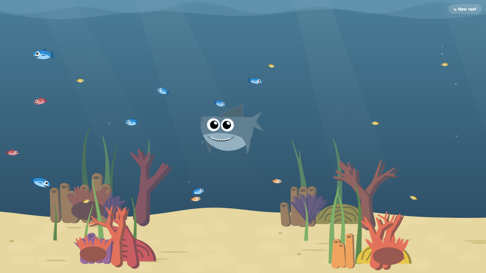

# Underwater Reef

An interactive cartoon underwater scene in a single self-contained HTML page. Move your cursor (or finger) near the fish to startle them, watch the shark cruise through and scatter the reef, grab and drag the shark yourself — then hit **↻ New reef** to regenerate the whole scene from a new seed.

**▶ Live:** https://scriptease.github.io/underwater-reef/

## What's in it

- A procedurally generated reef — every seed grows a different arrangement of coral, and the seed persists across reloads so you keep the same reef until you ask for a new one.
- 17 fish across 4 species that hide in the coral, flee your cursor, and panic when the shark looks their way.
- A roaming shark you can grab and drag through the water.

## How it's built

One file, no dependencies (`index.html`). Three layers — water and light, procedural coral, and fish — composed onto a single 2D canvas.

The story behind it: https://scripteasesite.wordpress.com/2026/07/31/hosting-fish-slop/
